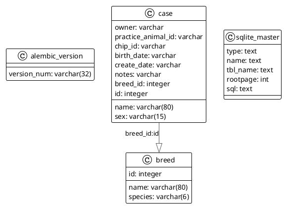

# Full stack reference application template

This is a full stack application demonstrating a reference architecture for a modern web application.

It uses the following technologies for each layer:

- Backend: FastAPI with SQLModel ORM for serialization (loosely coupled to the database models).
- Frontend: Vue.js with Vite build tool. Single-page application with routing and state management. Served using
  FastAPI's static file serving capabilities for simplicity, but can be easily switched to a separate frontend server or
  CDN in production.
- Database: SQLite (for simplicity, but can be easily switched to PostgreSQL or MySQL) using SQLModel as the ORM and
  Alembic for migrations. (SQLAlchemy is also an option as SQLModel is built on top of it)
- Testing: Pytest

## Running the Application

```shell
python main.py
```

Your browser should open automatically to <http://localhost:8000> and you should see the frontend application as below.
The backend API will be available at <http://localhost:8000/api>.


# Development information

## Alembic Migrations

To create a new migration after changing the database models, run:

```shell
cd database
alembic revision --autogenerate -m "Migration message"
```

Then edit the generated migration file in `database/alembic/versions/` as needed.

To apply migrations, run:

```shell
cd database
alembic upgrade head
```

## Running Tests

```shell
python -m pytest test -n4 --cov=backend --cov-report=term-missing
```

## Project Structure

```asciiart
.
├── backend/                # Backend application code
│   ├── api.py                  # FastAPI app factory or main entry point
│   ├── config.py               # App configuration (env vars, settings)
│   ├── api_models.py           # Pydantic models for API schemas
│   ├── routes/                 # API route modules
│   │   ├── breed.py                # /breed endpoints
│   │   ├── case.py                 # /case endpoints
│   │   ├── species.py              # /species endpoints
│   │   └── sex.py                  # /sex endpoints
│   ├── services/               # Business logic and service layer
│   └── static_data/            # Static data (e.g., dog breeds)
│       ├── breeds/                 # Breed data by species
│       │   ├── canine.py               # Canine breeds
│       │   ├── equine.py               # Equine breeds
│       │   └── feline.py               # Feline breeds
│       └── clinical_question.py    # Clinical question enums and logic
├── database/               # Database-related files
│   ├── alembic/                # Database migration files
│   │   ├── env.py                  # Alembic environment
│   │   ├── script.py.mako          # Alembic script template
│   │   └── versions/               # Migration versions
│   ├── alembic.ini             # Alembic configuration file
│   ├── app.db                  # SQLite database file for the app
│   └── core/                   # Database core modules
│       ├── models.py               # SQLModel ORM models for database
│       └── session.py              # Database session and engine setup
├── docs/                   # Documentation files
├── frontend/               # Frontend application (Vite + Vue)
│   ├── index.html              # Main HTML entry
│   ├── node_modules/           # Node.js dependencies
│   ├── package.json            # Frontend dependencies and scripts
│   ├── package-lock.json       # Lockfile for npm
│   ├── public/                 # Static public assets
│   ├── src/                    # Vue source code
│   └── vite.config.js          # Vite configuration
├── test/                    # Pytest tests and fixtures
│   ├── conftest.py              # Test fixtures and setup
│   ├── test_api_db.py           # Tests for database/API interactions
│   ├── test_breed.py            # Tests for /breed endpoints
│   ├── test_case.py             # Tests for /case endpoints
│   ├── test_root.py             # Tests for /api root endpoint
│   ├── test_sex.py              # Tests for /sex endpoints
│   └── test_species.py          # Tests for /species endpoints
├── main.py                  # Main entry point: FastAPI app factory, router registration, and Uvicorn startup
├── pyproject.toml           # Project and tool configuration (Ruff, etc.)
├── README.md                # Project documentation
├── requirements-dev.txt     # Development dependencies (pytest, ruff, pre-commit)
├── requirements.txt         # Main Python dependencies
└── run.sh                   # Shell script to run the app
```

## Backend API summary

Below is a list of the main API endpoints provided by the FastAPI backend.

### Root

- `GET /api/` — Root endpoint providing basic API information.

### Animal Information

- `GET /api/breed` — List all breeds (optionally filter by species)
- `GET /api/breed/{breed_id}` — Retrieve a breed by ID
- `GET /api/breed/by_name/{breed_name}` — Retrieve a breed by name
- `GET /api/species` — List all possible animal species
- `GET /api/sex` — List all possible animal sexes

### Cases

- `GET /api/case` — List all clinical cases
- `POST /api/case` — Create a new clinical case
- `GET /api/case/{case_id}` — Retrieve a clinical case by ID
- `PUT /api/case/{case_id}` — Update a clinical case by ID
- `DELETE /api/case/{case_id}` — Delete a clinical case by ID

## Database class diagram



## Coding Standards

01. All commit messages must follow conventional-commit rules (<https://www.conventionalcommits.org/en/v1.0.0/#summary>)
02. All code must pass ruff checks (<https://beta.ruff.rs/docs/>), including formatting
03. All code musy conform to the structure of the template files
04. All code must be covered by tests. Coverage must be >90%
05. Python files should be type-annotated as much as possible.
06. Docstring style is Google style (<https://google.github.io/styleguide/pyguide.html#38-comments-and-docstrings>.
07. Function and method docstrings should have Args, Returns and Raises sections as appropriate.
08. FastAPI endpoints should have fully decorated parameters (e.g. Path, Query, Body etc.) so they render correctly in
    the OpenAPI docs.
09. All files must conform to the template files in the `templates/` directory
10. Max line length is 120 characters for python files.
